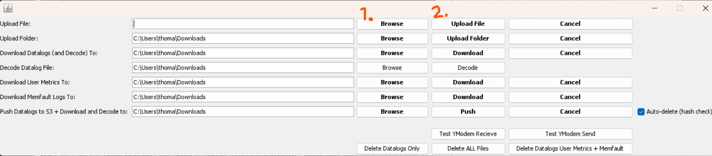

# closeNIT-hackathon-2025

This repository contains the code to interface with the Elemind EEG devices provided for the [Neurotechnology Hackathon 2025](https://research.ncl.ac.uk/close-nit/eventsfundingcalls/neurotechnologyhackathon/).

## EEG Headband

The EEG headband is made by [Elemind](https://elemindtech.com/). It features three EEG electrodes and reference. Labelled according to the [10-20 system](https://en.wikipedia.org/wiki/10%E2%80%9320_system_(EEG)):
- Fp1 (left prefrontal cortex)
- Fpz (central prefrontal cortex)
- Fp2 (right prefrontal cortex)

The electrode voltages are referred to the skin above the ears at the sides of the headband.


The headband can be interfaced with over USB to a PC running either the [MATLAB](./MATLAB/) or [Python](./Python/) software packages in this repository.

## System Requirements

If Java is already installed on your system, uninstall it.

Then download Java from this website specifically: [Oracle JDK 24](https://www.oracle.com/java/technologies/downloads/).

If you are using the MATLAB interface, install the [parallel computing toolbox](https://uk.mathworks.com/help/parallel-computing/getting-started-with-parallel-computing-toolbox.html). If you are using the Python interface, install the packages in the attached [Requirements.txt](./Python/Requirements.txt) file.


## Closed Loop Neuromodulation

The headband has a bone conductive audio driver which can modulate neural activity using sound. This audio driver will be the mechanism for which the loop will be 'closed' in your closed loop neurmodulation sytem - by applying sound stimulation according to your chosen features of EEG.


## Output Files

Whether using the Python or MATLAB interface, log files in '*.txt' file format will be created. After the competition on Friday, these '*.txt' files must be uploaded to Google Drive in the folder corresponding to your team number. [Google Drive link here](https://drive.google.com/drive/folders/18xulyURHJXOhcUgQpgJKI6XIgC1ui9fs?usp=sharing).

On the day of the competition, EEG log files must be named according to the following convention:
```
Team_{x}_sid_{y}.txt
```
Where **{x}** is the team number (1-11) and **{y}** is the subject number (1-20). For example, the log file for Team 4's 7th subject should be '*Team_4_sid_7.txt*'.

Recordings should be 3 minutes long (60 seconds baseline, 2 minutes stimulation).


## Serial Commands

Whether interfacing with the device over MATLAB or Python, the same serial commands will be sent to control the device parameters.

<hr>
<hr>

### Audio Commands

#### audio_set_volume

**Parameters:**
* **(int)** master_volume <0-255>

**Description**

Sets the master volume of the audio output. Parameter value ranges from 0 (no volume) to 255 (full volume).

**Examples**
```bash
audio_set_volume 0 # Sets volume to 0%
audio_set_volume 128 # Sets volume to 50%
audio_set_volume 255 # Sets volume to 100%
```

<hr>

#### audio_pause

**Description**

No parameters - pauses audio output.

**Examples**
```bash
audio_pause # Pauses audio output
```

<hr>

#### audio_unpause

**Description**

No parameters - unpauses audio output.

**Examples**
```bash
audio_unpause # Unpauses audio output
```

<hr>

#### audio_pink_volume

**Parameters:**
* **(float)** pink_volume <0-1>

**Description**

Sets the volume of the pink noise, float value between 0 and 1. 1 is full volume, 0 is no volume.

**Examples**
```bash
audio_pink_volume 0.5 # Sets the pink noise volume to 50%
```

<hr>

#### audio_pink_fade_in

**Parameters:**
* **(int)** duration in milliseconds

**Description**

Sets the amount of time over which the pink noise will gradually increase in volume from 0 to the volume programmed with the '*audio_pink_volume*' command. Time set in milliseconds.

**Examples**
```bash
audio_pink_fade_in 500 # Pink noise volume to reach programmed volume over 0.5 seconds after starting from 0
```

<hr>

#### audio_pink_fade_out

**Parameters:**
* **(int)** duration in milliseconds

**Description**

Sets the amount of time over which the pink noise will gradually decrease in volume from the volume programmed with the '*audio_pink_volume*' command to 0. Time set in milliseconds.

**Examples**
```bash
audio_pink_fade_out 500 # Pink noise volume to reach 0 over 0.5 seconds starting from programmed volume
```

<hr>

#### audio_pink_play

**Description**

No parameters - Starts playing pink noise audio.

**Examples**
```bash
audio_pink_play # Start playing pink noise audio output
```

<hr>

#### audio_pink_stop

**Description**

No parameters - Stops playing pink noise audio.

**Examples**
```bash
audio_pink_stop # Stop playing pink noise audio output
```

<hr>

#### audio_pink_mute

**Description**

No parameters - mutes the pink noise output volume.

**Examples**
```bash
audio_pink_mute # Mutes pink audio output
```

<hr>

#### audio_pink_unmute

**Description**

No parameters - unmutes the pink noise output volume.

**Examples**
```bash
audio_pink_unmute # Unmutes pink audio output
```

<hr>

#### audio_bg_volume

**Parameters:**
* **(float)** Background wav file volume <0-1>

**Description**

Sets the volume of the the specified background wav file, float value between 0 and 1. 1 is full volume, 0 is no volume.

**Examples**
```bash
audio_bg_volume 0.2 # Sets the pink noise volume to 20%
```

<hr>

#### audio_bg_fade_in

**Parameters:**
* **(int)** duration in milliseconds

**Description**

Sets the amount of time over which the specified background wav file will gradually increase in volume from 0 to the volume programmed with the '*audio_bg_volume*' command. Time set in milliseconds.

**Examples**
```bash
audio_bg_fade_in 500 # Wav file volume to reach programmed volume over 0.5 seconds after starting from 0
```

<hr>

#### audio_bg_fade_out

**Parameters:**
* **(int)** duration in milliseconds

**Description**

Sets the amount of time over which the specified background wav file will gradually decrease in volume from the volume programmed with the '*audio_bg_volume*' command to 0. Time set in milliseconds.

**Examples**
```bash
audio_bg_fade_out 500 # Wav file volume to reach 0 over 0.5 seconds starting from programmed volume
```

<hr>

#### audio_bgwav_play

**Parameters:**
* **(string)** Path to wav file on the headband filesystem
* **(int)** loop disable/enable <0-1>

**Description**

Starts playing the wav file audio that has been uploaded to the headband's filesystem. Set second parameter to 0 to play once, or 1 to loop.

**Examples**
```bash
audio_bgwav_play /audio/RAIN_22M.wav 1 # Start playing the RAIN_22M.wav file and loop it.
audio_bgwav_play /audio/RAIN_22M.wav 1 # Start playing the RAIN_22M.wav file and just play it once.
```

<hr>

#### audio_bgwav_stop

**Description**

No parameters - Stops playing wav file audio.

**Examples**
```bash
audio_bgwav_stop # Stop playing wav file audio output
```

<hr>
<hr>

### Stream Commands

#### stream

**Parameters:**
* **(string)** data-type <eeg, accel, leadoff, inst_amp_phs, all>
* **(int)** off/on <0-1>

**Description**

Disables/Enables streaming of corresponding data-type from headband for input parameter 0/1 respectively. Streaming of instantaneous amplitude and phase data from headband only works when *echt* commands are properly configured (detailed below).

**Examples**
```bash
stream eeg 1 # Enables streaming of EEG
stream accel 0 # Disables streaming of accelerometer data
stream leadoff 1 # Enables streaming of electrode contact impedance
stream inst_amp_phs 1 # Enables streaming of instantaneous amplitude and instantaneous phase
```

<hr>
<hr>

### Signal Processing Commands

#### therapy_enable_line_filters

**Parameters:**
* **(int)** off/on <0-1>

**Description**

Disables/Enables ~35Hz lowpass filter which serves to attenuate line noise at both 50Hz and 60Hz.

**Examples**
```bash
therapy_enable_line_filters 1 # Enables line filtering on-device
```

<hr>

#### therapy_enable_az_filters

**Parameters:**
* **(int)** off/on <0-1>

**Description**

Disables/Enables auto-zero DC filter which serves to attenuate low-frequency drift.

**Examples**
```bash
therapy_enable_az_filters 1 # Enables DC filtering on-device
```

<hr>

#### therapy_enable_ac_filters

**Parameters:**
* **(int)** off/on <0-1>

**Description**

Disables/Enables 31Hz bandstop filter which serves to attenuate noise generated internally.

**Examples**
```bash
therapy_enable_ac_filters 1 # Enables band-stop filtering on-device
```

<hr>

#### therapy_enable_alpha_track

**Parameters:**
* **(int)** off/on <0-1>

**Description**

Disables/Enables the automatic tracking of alpha frequency for ecHT phase-locking. Setting to 0 is necessary to override with custom centre bandpass frequency, set using '*echt_config_simple*'.

**Examples**
```bash
therapy_enable_alpha_track 0 # Sets device to disable automatic alpha-band tracking
```

<hr>

#### echt_config_simple

**Parameters:**
* **(int)** Centre frequency for phase-locking band

**Description**

Sets the centre frequency of the frequency band which the on-device ecHT phase locking will track the phase of. Only works if '*therapy_enable_alpha_track*' set to 0.

**Examples**
```bash
therapy_enable_alpha_track 0 # Sets device to disable automatic alpha-band tracking
echt_config_simple 10 # Sets device to phase-lock to band centred on 10Hz
```

<hr>

#### echt_set_min_max_phase

**Parameters:**
* **(int)** Minimum phase-angle for starting phase-locked audio burst, degrees
* **(int)** Maximum phase-angle for stopping phase-locked audio burst, degrees

**Description**

When ecHT is enabled, bursts of audio (pink noise) will be started when the minimum phase angle is detected, and ended when the  maximum phase angle is detected. Both are set using this command. Angle must be specified in degrees and is the angle of a cosine wave, meaning 0 degrees is wave-peak, 180 degrees is wave-trough, 90 and 270 degrees are zero-crossings.

**Examples**
```bash
echt_set_min_max_phase 45 135 # Sets phase locked audio burst to start at 45degrees and end at 135degrees
```

<hr>
<hr>

### Session Control Commands

#### eeg_start

**Description**

Starts the recording/streaming of EEG

**Examples**
```bash
eeg_start # Starts recording of EEG on-device and streaming
```

<hr>

#### eeg_stop

**Description**

Stops the recording/streaming of EEG

**Examples**
```bash
eeg_stop # Stops recording of EEG on-device and streaming
```

<hr>

#### accel_start

**Description**

Starts the recording/streaming of accelerometer data

**Examples**
```bash
accel_start # Starts recording of accelerator data on-device and streaming
```

<hr>

#### accel_stop

**Description**

Stops the recording/streaming of accelerometer data

**Examples**
```bash
accel_stop # Starts recording of accelerometer data on-device and streaming
```

<hr>

#### echt_start

**Description**

Starts the recording/streaming of instantaneous amplitude and phase, and start bursting pink noise audio. Only works if pink noise has volume above 0 and has been started with '*audio_pink_play*' command.

**Examples**
```bash
echt_start # Starts recording and streaming of instantaneous amplitude and phase on-device and bursts pink noise audio according to programmed frequency and phase parameters
```

<hr>

#### echt_stop

**Description**

Stops the recording/streaming of instantaneous amplitude and phase, and stops bursting pink noise audio.

**Examples**
```bash
echt_stop # Stops recording and streaming of instantaneous amplitude and phase on-device and stops bursting pink noise audio
```

<hr>
<hr>

## Uploading Audio Files

The Elemind headband has its own filesystem to which you can upload a wav file that can be played on the bone conductive audio driver. You must upload a file that has a **Sampling Rate of 22.05 kHz**, and the file must be **monophonic/single channel**.

Free software like [Audacity](https://www.audacityteam.org) can be used to mix stereo audio files down to mono audio files.


It can also be used to export WAV files at 22.05 kHz.


Trim the recording length to less than 30 seconds, the final file size should be around 1.3MB.

Once the WAV file is ready, it can be uploaded using the [Morpheus Controller](./MorpheusController-1.80.ext.jar) application.

There are two steps to the upload process.

1. Upload the file

Connect to the Elemind headband by selecting the appropriate port and clicking 'Open'.


Click Configuration -> File Upload


Browse for the file in your PC's filesystem - then upload the file. It will stream percent progress in the background - do not type anything while it is streaming. If it ends with command not found, don't worry about it.



2. Move the file to the audio folder

Once uplaoded, the file will not go to audio folder. It is in root level of the filesystem. It must be moved to the audio folder. In the commands window, type and send:
```
fs_mv /<audiofilename> /audio/<audiofilename>
```


Verify the file has been moved with:
```
fs_ls /audio
```

You can now play that wav file with the serial command:
```
audio_bgwav_play /audio/example.wav 1
```
